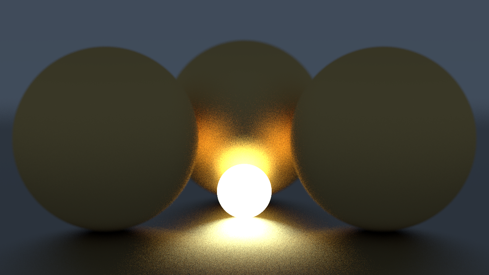

# C# Software Ray Tracer
A ray tracing project written in C# made by following the [_Ray Tracing in One Weekend_](https://raytracing.github.io/books/RayTracingInOneWeekend.html) book series.

## Features
* Different materials: (Matte, Metallic, & Diffuse Light)
* Multithreaded rendering
* Depth of field effects
* PNG output

## Sample Renders

## Running
> Currently only supported on Windows!
1. Create an environment in `Environments.cs`
2. Set rendering parameters in `Program.cs`
    - For renders using diffuse lights, get the best results using a high 'samples per pixel' setting.
3. Run from the console with `dotnet run`, your output will look like `[WIDTH]x[HEIGHT]\_render.png`
