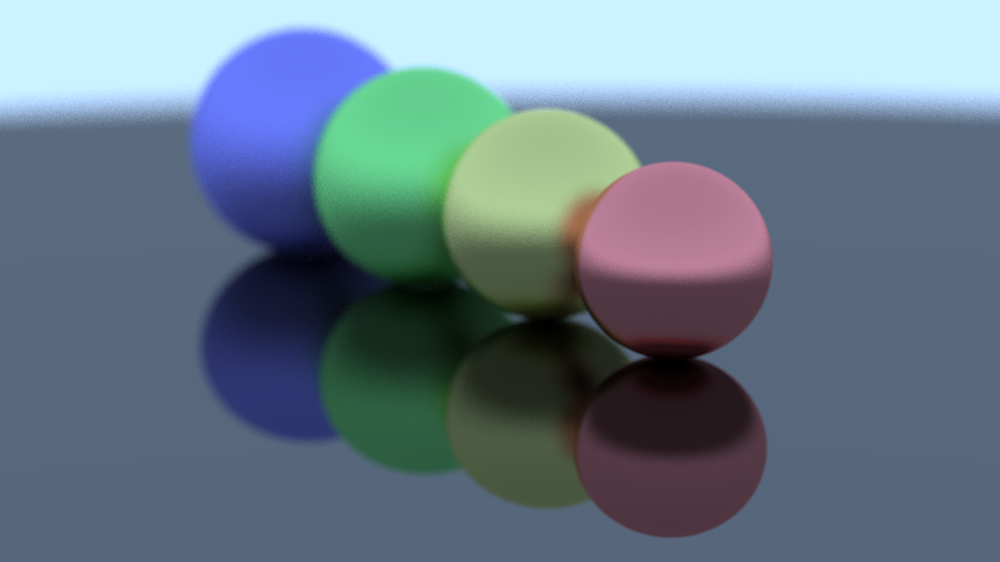
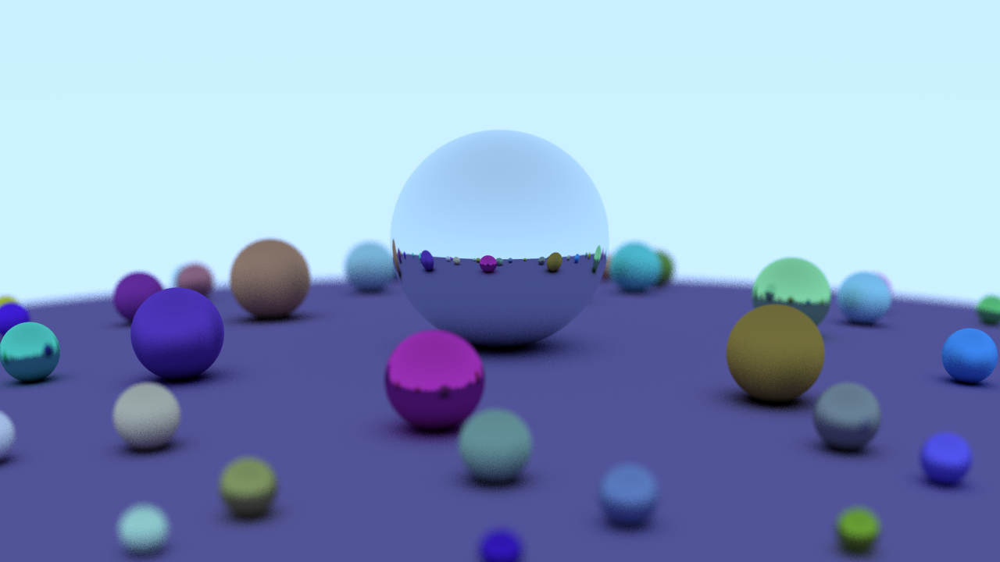

# C# Software Ray Tracer
A ray tracing project written in C# inspired by the [_Ray Tracing in One Weekend_](https://raytracing.github.io/books/RayTracingInOneWeekend.html) book series.

## Features
* Different materials: (Matte, Metallic, & Diffuse Light)
* Multithreaded rendering
* Depth of field effects
* PNG output

## Sample Renders

